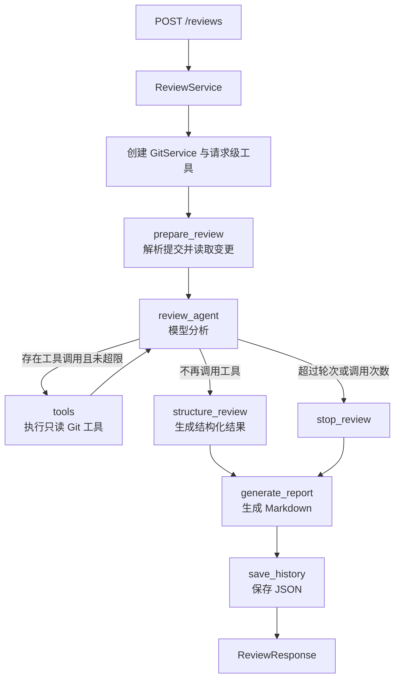

# 基于 LangGraph 的智能代码审查 Agent

一个面向学习与实践的轻量级 Git 代码审查项目。系统接收本地仓库路径和
Commit Range，通过 LangGraph 编排大模型与只读 Git 工具，对代码变更进行循环分析，
最终返回经过 Pydantic 校验的结构化问题列表，并生成 Markdown 报告和 JSON 历史记录。

> 当前版本：`0.7.0`
>
> 项目定位：单 Agent、可运行、可测试、可解释的代码审查工作流示例。

## 核心能力

- 使用 LangGraph 构建“模型分析 → 工具调用 → 继续分析 → 结构化收尾”的循环工作流。
- 支持指定 `base_ref` 与 `head_ref`，审查分支、标签、短 SHA 或完整 SHA 之间的变更。
- 向模型提供 `list_changed_files`、`read_diff`、`read_file`、`search_code` 四个只读 Git 工具。
- 支持 `review_focus` 和 `custom_rules`，可为每次请求指定审查重点与项目规范。
- 使用 Pydantic 和确定性规则过滤无效结果，只保留变更文件新增行上的问题。
- 对仓库边界、路径穿越、敏感文件、Git 超时和模型输出长度进行限制。
- 每次审查生成独立的 Markdown 报告和 JSON 历史记录，并提供历史查询接口。
- 内置 50 个合成 Git 场景，支持 Precision、Recall 和用例通过率统计。
- 提供不调用真实模型的自动化测试，覆盖 Git、工具、图节点、API、历史记录和评测器。

## 技术栈

- Python 3.11+
- FastAPI / Uvicorn
- LangGraph / LangChain
- OpenAI Compatible API（默认配置为 DeepSeek）
- Pydantic / pydantic-settings
- Git
- Pytest / Ruff

## 工作流程



图中的节点只返回需要更新的字段，LangGraph 会把这些局部更新合并进
`ReviewState`。其中 `messages` 使用 `add_messages` reducer 追加模型消息和工具结果，
使下一轮模型调用能够看到完整上下文。

### 为什么分成两次模型调用

本项目将工具调用与最终结构化输出拆开：

1. `review_agent` 使用绑定了工具的模型判断是否还需要读取仓库信息。
2. 模型停止调用工具后，`structure_review` 使用
   `with_structured_output(ModelReviewResult)` 生成严格 JSON 结构。
3. 程序再根据 Diff 新增行、变更文件和重复项执行确定性过滤。

这种设计使工具路由更清晰，也避免把“是否继续探索”和“最终 JSON 格式”混在同一次响应中。

## 四个只读工具

| 工具 | 输入 | 返回内容 |
|---|---|---|
| `list_changed_files` | 无 | Commit Range 内的变更状态与相对路径 |
| `read_diff` | 可选文件路径 | 整体或单文件 Unified Diff |
| `read_file` | 文件路径 | Head Commit 中带行号的文件内容 |
| `search_code` | 关键词、可选路径 | `文件:行号:内容` 格式的匹配结果 |

仓库路径、Base Commit 和 Head Commit 由工具闭包固定，模型不能通过工具参数切换到其他
本地仓库或其他提交范围。

## 项目结构

```text
langgraph-code-review-agent-lite/
├── src/code_review_agent_lite/
│   ├── config.py          # 环境配置
│   ├── schemas.py         # API 与结构化输出模型
│   ├── git_service.py     # 只读 Git 能力与安全边界
│   ├── tools.py           # LangChain 工具封装
│   ├── reviewer.py        # 模型创建与审查提示词
│   ├── state.py           # LangGraph 状态定义
│   ├── nodes.py           # 工作流节点
│   ├── graph.py           # 图构建与条件路由
│   ├── service.py         # API 和评测器共享的应用服务
│   ├── history.py         # JSON 历史记录
│   ├── evaluator.py       # 评测数据模型与评分逻辑
│   └── main.py            # FastAPI 入口
├── scripts/
│   ├── create_demo_repository.py
│   └── run_evaluator.py
├── evals/cases.json       # 50 个合成评测场景
├── tests/                 # 自动化测试
├── outputs/               # 报告、历史与评测结果（默认不提交）
├── .env.example
├── pyproject.toml
└── README.md
```

## 快速开始

### 1. 克隆并安装

```powershell
git clone https://github.com/haoyujie001/langgraph-code-review-agent-lite.git
cd langgraph-code-review-agent-lite

python -m venv .venv
.\.venv\Scripts\Activate.ps1
python -m pip install -e ".[dev]"
```

### 2. 配置环境变量

```powershell
Copy-Item .env.example .env
```

编辑 `.env`，至少设置允许访问的仓库根目录和模型密钥：

```dotenv
CODE_REVIEW_ALLOWED_REPO_ROOT=D:\agent
CODE_REVIEW_LLM_MODEL=deepseek-chat
CODE_REVIEW_LLM_API_KEY=your-api-key
CODE_REVIEW_LLM_BASE_URL=https://api.deepseek.com
```

`.env` 已被 Git 忽略。不要把真实 API Key 写入 `.env.example` 或提交到仓库。

### 3. 启动服务

```powershell
python -m uvicorn code_review_agent_lite.main:app --reload
```

启动后可访问：

- 健康检查：<http://127.0.0.1:8000/health>
- Swagger 文档：<http://127.0.0.1:8000/docs>

## 创建演示仓库

项目提供脚本生成一个包含两个提交的真实 Git 仓库，便于在不使用业务代码的情况下体验审查流程。
目标目录必须不存在或为空，脚本不会删除已有文件。

```powershell
$demo = python scripts\create_demo_repository.py `
    --target outputs\demo-repository | ConvertFrom-Json

$demo
```

输出包含：

```text
path
base_sha
head_sha
```

## 发起代码审查

```powershell
$body = @{
    repo_path = $demo.path
    base_ref = $demo.base_sha
    head_ref = $demo.head_sha
    review_focus = @("安全性", "异常处理")
    custom_rules = @("所有 SQL 必须使用参数化查询")
} | ConvertTo-Json

Invoke-RestMethod `
    -Method Post `
    -Uri "http://127.0.0.1:8000/reviews" `
    -ContentType "application/json" `
    -Body $body
```

响应示例：

```json
{
  "review_id": "7f2cc86b-93e7-45e5-98ce-21dc9bf308e7",
  "status": "completed",
  "base_commit": "<完整 Base SHA>",
  "head_commit": "<完整 Head SHA>",
  "summary": "发现一处高风险 SQL 注入问题。",
  "findings": [
    {
      "path": "src/app.py",
      "line": 5,
      "severity": "high",
      "category": "security",
      "message": "SQL 查询直接拼接了 user_id。",
      "suggestion": "使用参数化查询和绑定参数。"
    }
  ],
  "markdown_report": "outputs/review-7f2c...md",
  "error": null
}
```

模型是否调用工具由其当前判断决定。工作流通过最大轮次和总工具调用次数限制循环规模。

## API 接口

| 方法 | 路径 | 说明 |
|---|---|---|
| `GET` | `/health` | 服务健康检查 |
| `POST` | `/reviews` | 对指定 Commit Range 发起审查 |
| `GET` | `/reviews?limit=20` | 按时间倒序查询历史记录 |
| `GET` | `/reviews/{review_id}` | 查询单次审查详情 |

### 审查请求限制

- `review_focus`：最多 5 项，每项 1～200 个字符。
- `custom_rules`：最多 10 项，每项 1～200 个字符。
- 重复指令会按原顺序去重。
- 最终最多返回 10 条有效 Finding。
- `severity` 只能是 `low`、`medium`、`high`、`critical`。
- `category` 只能是 `security`、`bug`、`performance`、`maintainability`。

常见错误映射：

| HTTP 状态码 | 场景 |
|---|---|
| `400` | 仓库、提交范围或 Git 参数无效 |
| `404` | 历史记录不存在 |
| `422` | 请求未通过 Pydantic 校验 |
| `500` | 历史记录保存失败 |
| `502` | 模型调用或结构化输出失败 |
| `503` | 未配置模型密钥等模型配置错误 |

## 配置项

所有配置使用 `CODE_REVIEW_` 前缀，可在 `.env` 或系统环境变量中设置。

| 配置 | 默认值 | 说明 |
|---|---:|---|
| `ALLOWED_REPO_ROOT` | 当前目录 | 允许审查的本地仓库根目录 |
| `GIT_TIMEOUT_SECONDS` | `10` | 单次 Git 命令超时 |
| `MAX_FILE_CHARS` | `20000` | 单文件返回字符上限 |
| `MAX_DIFF_CHARS` | `50000` | Diff 返回字符上限 |
| `MAX_SEARCH_RESULTS` | `20` | 搜索结果数量上限 |
| `MAX_AGENT_ROUNDS` | `6` | Agent 工具循环轮数上限 |
| `MAX_TOOL_CALLS` | `12` | 总工具调用次数上限 |
| `LLM_MODEL` | `deepseek-chat` | 模型名称 |
| `LLM_BASE_URL` | `https://api.deepseek.com` | OpenAI Compatible API 地址 |
| `LLM_TIMEOUT_SECONDS` | `60` | 模型请求超时 |
| `LLM_TEMPERATURE` | `0` | 模型温度 |
| `LLM_STRUCTURED_OUTPUT_METHOD` | `json_mode` | 结构化输出方式 |
| `OUTPUT_DIR` | `outputs` | Markdown 报告目录 |
| `HISTORY_DIR` | `outputs/history` | JSON 历史记录目录 |

完整配置请查看 [`.env.example`](.env.example)。

## 结构化结果校验

模型首先生成 `ModelReviewResult`，随后程序执行以下硬性校验：

1. 文件必须属于本次变更文件。
2. 行号必须是正整数。
3. 行号必须位于完整 Diff 的 Head 新增行集合中。
4. 严重程度和问题类别必须来自固定枚举。
5. 相同文件、行号和类别的问题会被去重。
6. 最终最多保留 10 条问题。

提示词属于软约束，以上程序校验属于硬约束。两者结合可以减少行号幻觉、越界报告和重复问题，
但不能保证模型发现所有真实缺陷。

## 安全设计

- 只允许访问 `CODE_REVIEW_ALLOWED_REPO_ROOT` 下的仓库。
- 要求 `repo_path` 指向真实 Git 工作区根目录。
- 将 Base/Head ref 解析为不可变的完整 Commit SHA 后再执行审查。
- Git 子进程不经过 Shell，并设置执行超时。
- 校验仓库相对路径，阻止绝对路径、`..`、符号链接逃逸和 `.git` 访问。
- 过滤 `.env`、私钥、凭据文件和常见密钥清单等敏感路径。
- 限制文件、Diff、搜索结果、Agent 轮次和工具调用总数。
- 工具仅提供读取能力，不执行提交、修改或删除操作。

敏感路径过滤只是降低风险的边界措施，不等同于完整的 Secret Scanner。将私有仓库内容发送给
外部模型前，仍应确认代码与模型服务商的数据策略满足你的安全要求。

## 报告与历史记录

每次工作流运行都会生成独立文件：

```text
outputs/review-<uuid>.md
outputs/history/<review-id>.json
```

历史记录包含请求参数、解析后的提交 SHA、审查规则、变更文件、工具计数、结构化问题、
Markdown 路径和错误信息。保存时先写临时文件，再通过替换操作完成最终写入，降低半写入文件风险。

该实现适用于单机学习和轻量使用；它不是 LangGraph Checkpointer，也不能恢复中断的图执行。

## 运行评测

[`evals/cases.json`](evals/cases.json) 包含 50 个合成双提交场景：

- 38 个问题场景：12 个 security、10 个 bug、8 个 performance、8 个 maintainability。
- 12 个安全样例，用于观察误报。

先运行一个低成本冒烟场景：

```powershell
python -m scripts.run_evaluator --max-cases 1
```

运行指定场景：

```powershell
python -m scripts.run_evaluator --case-id sort_only_for_max
```

运行全部场景：

```powershell
python -m scripts.run_evaluator
```

评测器会为每个场景创建真实的 Before/After Git 提交，调用完整 `ReviewService`，再根据稳定字段
`path`、`category` 以及可选的 `line`、`severity` 进行一对一匹配。结果写入：

```text
outputs/evaluations/evaluation-<timestamp>.json
```

报告包含用例通过数、匹配数、遗漏项、额外发现、Precision 和 Recall。完整评测会产生多次真实
模型调用和相应费用；项目只提供评测能力，不把单次或部分运行结果宣传为完整模型准确率。

## 运行测试

```powershell
python -m pytest
python -m ruff check .
```

自动化测试不需要真实模型密钥：测试使用可预测的脚本模型，同时仍会执行真实 Git Diff、
完整 LangGraph、结构化转换、结果过滤、FastAPI 序列化、报告与历史记录写入。

当前仓库包含 50 项可重复执行的离线测试。

## 当前边界

这是一个 Lite 学习项目，刻意保留了清晰、容易理解的单 Agent 架构。目前主要限制包括：

- API 和模型调用为同步执行，不适合长时间、高并发审查任务。
- 历史记录使用本地 JSON 文件，不适合多实例部署和大规模查询。
- 只审查 Diff 新增行，可能忽略由新代码触发、但定位在旧代码中的问题。
- 主要依赖大模型进行语义判断，尚未结合 AST、静态分析器或依赖漏洞数据库。
- 工具输出虽然会截断，但 Git 子进程仍会先捕获完整标准输出。
- 模型结果具有非确定性，评测结果会受到模型版本、提示词和服务状态影响。

面向生产环境可进一步加入异步任务队列、数据库、身份认证、仓库托管平台集成、静态分析器、
可观测性以及更大规模的真实缺陷评测集。

## License

当前仓库未提供独立 License 文件。在选择开源许可证之前，请不要默认该项目已授权自由复制、
修改或再分发。
